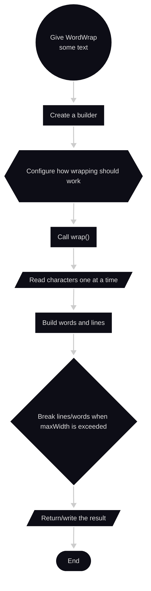

# Overview for WordWrap.java

## High-level overview of ```WordWrap()```



## 1. The outer ```WordWrap``` class

### **The declaration is:**

```java
public final class WordWrap {}
```

**Three pieces matter here:**
- ```public``` - other code can use this class
- ```class``` - defines a Java class
- ```final``` - nobody can create a subclass of ```WordWrap```

**Then:**

```java
private WordWrap() {
    // prevent instantiation
}
```
*The private constructor*

**Normally you could do:**

```java
WordWrap w = new WordWrap();
```
The constructor being private prevents this

Intentional as this class is being used as a util/factory class. Instead of creating a ```WordWrap``` object, you do:

```java
WordWrap.from("hello world");
```

The author's test suite verifies that ```WordWrap``` behaves as a utility class [WordWrapTest](/src/test/java/org/davidmoten/text/utils/WordWrapTest.java)

## 2. The constants at the top

### ```SPECIAL_WORD_CHARS```

```java
private static final String SPECIAL_WORD_CHARS = 
        "\"\'\u2018\u2019\u201C\u201D?./!,;:_";
```

String containing chars the library may treat as belongin to a word like:

```text
"
,
?
.
/
!
,
;
:
_
```

The ```\u2018```, etc., are Unicode codes for typographic quotation marks

Example:

```' ' " "```

**Syntax**

```java
private static final 
```

- ```private``` - only ```WordWrap``` uses it
- ```static``` - belonds to the class not individual object
- ```final``` - variable can't be assigned a diff value later

**One shared constant for the entire ```WordWrap``` class**

## 3. ```SPECIAL_WORD_CHARS_SET_DEFAULT```

```java
public static final Set<Character> SPECIAL_WORD_CHARS_SET_DEFAULT = 
    toSet(SPECIAL_WORD_CHARS);
```

Takes a string of special chars and converts it into a Java ```Set<Character>```

```Set``` is a collection of unique items

Instead of repeatedly searching this:

```"'?,/!,;:```

the program can ask something like:

```java
extractWordChars.contains(ch);
```

meaning: **is this character one of the special chars?**

```Character``` is Java's object representation of a ```char```

## 4. ```STRING_WIDTH_DEFAULT```

**Lambda expression**

```java
private static final Function<CharSequence, Number> STRING_WIDTH_DEFAULT =
    s -> s.length();
```

Mentally translate

```java
s -> s.length
```

into:

> Take some text called ```s``` and return its length

if:

```s = "hello"```

the lambda function returns:

```5```

```java
Function<CharSequence, Number>
```

means:

> A function that receives a ```CharSequence``` and returns a ```Number```

```String``` is one kind of ```CharSequence```

Default definition of "width" is simply:

```width = number of characters```

**Important** - because the API lets users replace that calculation with their own function. The existing 
tests demonstrate that feature with a lambda that doubles each character's effective width. [WordWrapTest](/src/test/java/org/davidmoten/text/utils/WordWrapTest.java)

## 5. ```PUNCTUATION```

```java
private static final String PUNCTUATION =
        "!\"#$%&'()*+,-./:;<=>?@[\\]^_`{|}~";
```

*A collection of punctuation symbols* where later the algorithm asks whether the current char is punctuation

## 6. The ```from(...)``` methods

Notice a lot of methods named ```from```

This is called **method overloading**

Java allows:

```java
from(Reader)
from(CharSequence)
from(InputStream, Charset)
from(File, Charset)
```

because the parameters are different

They all do roughly the same thing:

> Convert some source of text into a ```Builder```

### ```from(Reader reader)```

```java
public static Builder from(Reader reader) {
    return from(reader, false);
}
```

A ```Reader``` is Java's general abstraction for reading char data

An interesting part is:

```java
return from(reader, false);
```

there's another method later:

```java
static Builder from(Reader reader, boolean close)
```

**This method delegates to that one**

the `false` means:

> Don't automatically close the caller's Reader when finished

## 7. ```fromClasspathUtf8```

```java
public static Builder fromClasspathUtf8(String resource) {
    return fromClasspath(resource, StandardCharsets.UTF_8);
}
```

loads a text resource packaged with the application

For example, the tests do this:

```java
WordWrap.fromClasspathUtf8(
        "/the-importance-of-being-earnest.txt"
)
```

The method automatically assumes the file uses **UTF-8**

Basically shorthand for:

```java
fromClasspath(resource, StandardCharsets.UTF_8);
```

## 8. ```fromClasspath```

```java
public static Builder fromClasspath(String resource, Charset charset) {
    return new Builder(
        new BufferedReader(
            new InputStreamReader(
                WordWrap.class.getResourceAsStream(resource),
                charset)),
        true);
}
```

Breaking it down into steps:

### Step 1

```java
WordWrap.class.getResourceAsStream(resource)
```

find the resource and open it as raw bytes

### Step 2

```java
new InputStreamReader(..., charset)
```

turn those bytes into chars using the requested encoding

### Step 3

```java
new Builder(..., true)
```

give that Reader to a `Builder`

the `true` means:

> WordWrap owns this Reader, so close it when done

## 9. ```from(CharSequence text)```

**Probably the one used most for testing**:

```java
public static Builder from(CharSequence text) {
    return from(
            new BufferedReader(new CharSequenceReader(text)),
            true);
}
```

then write:

```java
WordWrap.from("hello world")
```

the string gets converted into a `Reader`, then a `Builder` is returned. [WordWrap](src/main/java/org/davidmoten/text/utils/WordWrap.java)

Can meaningfully ignore most of the plumbing and think:

```java
WordWrap.from("hello")
```

**means**:

> Start configuring a wrapping operation for `"hello"`

## 10. ```fromUtf8(InputStream in)```

another convenience method

it assumes an incoming stream contains UTF-8 text

## 11. ```from(InputStream in, Charset charset)```

```java
public static Builder from(InputStream in, Charset charset) {
    return from(
        new BufferedReader(
            new InputStreamReader(in, charset)));
}
```

**Raw input stream**:

```bytes```

**becomes**:

```characters```

using the chosen char encoding

then it calls the existing ```from(Reader)```

## 12. ```from(File file, Charset charset)```

```java
public static Builder from(File file, Charset charset) {
    try {
        return from(
            new BufferedReader(
                new InputStreamReader(
                    new FileInputStream(file),
                    charset)),
            true);
    } catch (FileNotFoundException e) {
        throw new IORuntimeException(e);
    }
}
```

This reads text from a file

the ```try/catch``` means:

> Try to open the file. If the file doesn't exist, convert Java's `FileNotFoundException` into the library's
> `IORuntimeException`

The existing tests exercise both successful file reading and the missing file exception [WordWrapTest](/src/test/java/org/davidmoten/text/utils/WordWrapTest.java)

## 13. Internal ```from(Reader, boolean)```

```java
@VisibleForTesting
static Builder from(Reader reader, boolean close) {
    return new Builder(reader, close);
}
```

Actually a simple cleanup factory:

```java
new Builder(reader, close)
```

```@VisibleForTesting``` is an annotation communicating:

> Isn't really a part of the main public API but its visibility allows tests to access it.

the boolean controls whether the Reader gets closed after wrapping

## 14. The nested ```Builder``` class

The most important class for this assignment/project:

```java
public static final class Builder {}
```

**This class stores all settings for one wrapping operation**

Conceptually:

```text
Builder
 ├─ source text
 ├─ maximum width
 ├─ newline style
 ├─ whether to insert hyphens
 ├─ whether to break long words
 ├─ special word characters
 └─ width calculation
```

This is the **Builder Pattern**

Which is why this can't be written:

```java
WordWrap.from("hello world")
        .maxWidth(6)
        .insertHyphens(false)
        .breakWords(true)
        .wrap();
```

Each configuration method returns the same Builder so calls can be chained